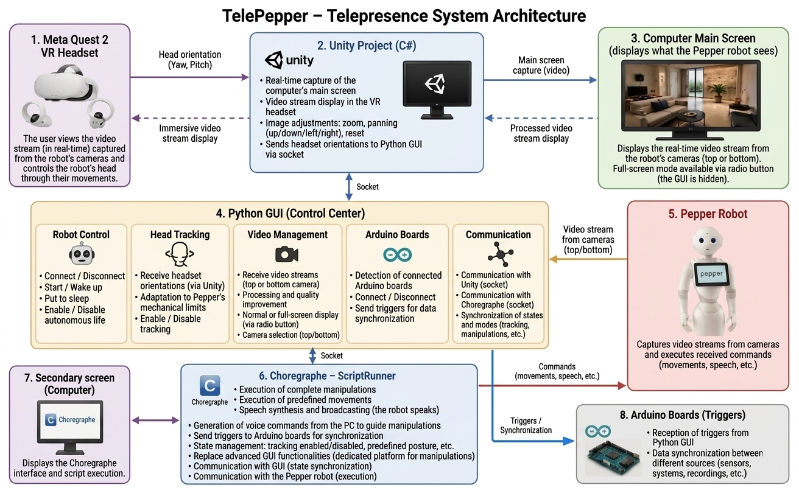
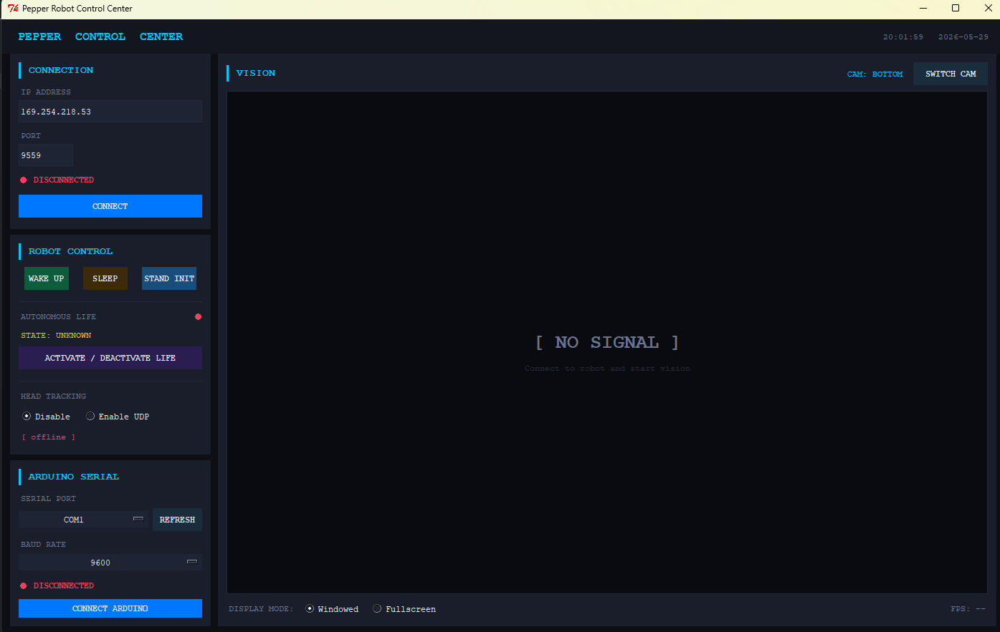

# TelePepper – Immersive Telepresence System (Pepper + VR)

TelePepper is an immersive telepresence platform enabling real-time interaction with the SoftBank Robotics Pepper robot using a Meta Quest 2 VR headset. The system integrates Unity (C#), a Python 2.7 GUI, Choregraphe (2.5.x), and custom experimental orchestration tools.

---

## Demo

Video demonstration of the TelePepper system:

[https://www.youtube.com/watch?v=YOUR_VIDEO_ID](https://youtu.be/0ePCSqo9ta8)

---

## System Overview

TelePepper combines:
- **VR visualization (Unity + Meta Quest 2)**
- **Robot control (Python GUI + NAOqi API)**
- **Experimental orchestration (Choregraphe + ScriptRunner)**
- **Hardware synchronization (Arduino triggers)**

Communication between modules is handled via network sockets.

---

## Architecture

The system is composed of four main subsystems:

- Unity VR interface (C#)
- Python 2.7 control GUI
- Choregraphe 2.5.x with ScriptRunner module
- Pepper robot (SoftBank Robotics)

### System Architecture Overview

---

## Requirements

### Software Dependencies

- **Python 2.7 (mandatory)**
- **NAOqi SDK (Python API for Pepper)**
- **Choregraphe 2.5.x**
- **Unity (project built in C#)**
- Meta Quest 2 runtime environment

### Important: NAOqi Installation

This project requires the NAOqi Python SDK to communicate with Pepper.

You must install the NAOqi SDK and correctly configure the Python path.

Installation instructions are available on the official ADLEBaran documentation website.

Make sure that:
- The NAOqi Python modules are accessible in your Python 2.7 environment
- Environment variables / PYTHONPATH are correctly configured

---

## Choregraphe Version

This project is compatible with:

> **Choregraphe 2.5.x**

Other versions may introduce incompatibilities with ScriptRunner behavior or socket communication protocols.

---

## Multi-Monitor Requirement

⚠️ **Important system constraint**

The system requires **at least two monitors**.

### Reason:
- Unity runs in fullscreen VR capture mode on the primary display
- When full-screen mode is activated by the Python GUI, the Unity display becomes inaccessible
- A second screen is required to:
  - Monitor the Python GUI
  - Operate Choregraphe simultaneously
  - Control robot behavior during experiments
  - Maintain access to system logs and debugging tools

Without a second monitor, system control becomes significantly restricted during full immersive mode.

---

## Python GUI (Important Notes)

The Python interface:
- Runs on **Python 2.7 only**
- Manages robot control via NAOqi
- Handles video stream selection and processing
- Provides VR synchronization input processing

Keyboard controls:
- `+ / - (numpad)` → Zoom in/out
- Arrow keys → Move video stream (up/down/left/right)
- `ESC` → Stop GUI execution

### Graphical Interface

---

## ScriptRunner Module

This subsystem provides:
- Robot posture generation
- Experimental scenario execution
- Automated behavioral scripting
- Synchronization signal generation

---

## Communication System

The system uses socket-based communication between:
- Unity ↔ Python GUI
- Python GUI ↔ Choregraphe
- Choregraphe ↔ Pepper robot
- Python GUI ↔ Arduino boards

This allows real-time synchronization of:
- Head tracking
- Robot motion
- Video streaming
- Experimental triggers

---

## Notes on Stability

- Ensure all components are started in the correct order:
  1. Pepper robot connection (Choregraphe / NAOqi)
  2. Python GUI
  3. Unity VR interface
- Network socket ports must be consistent across modules
- Full-screen mode should only be activated after system initialization

---

## License

This project is licensed under the MIT License.

See the `LICENSE` file for full details.

---

## Contact

For questions, collaborations, or contributions, please contact:

**Ahmad Kaddour**  
INSERM U1093, France  

Email: ahmad.kaddour@inserm.fr  

GitHub: https://github.com/Ahmad-k95
